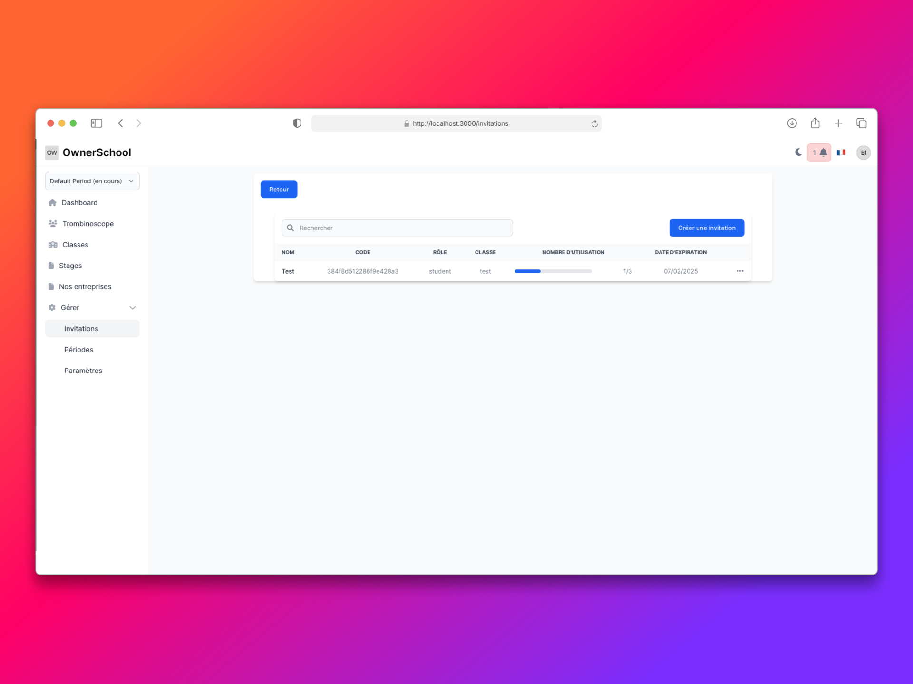

# Feature Invitations - Code Sample

Ce repository contient un extrait de code démontrant l'implémentation d'un système d'invitations dans une application Ruby on Rails. Ce code est fourni à titre démonstratif et ne peut pas être exécuté de manière autonome car il fait partie d'une application plus large.

## Contexte

Cette fonctionnalité fait partie d'une application de gestion de stage pour les établissements scolaire. Elle permet aux proviseurs/professeurs de créer des invitations pour que de nouveaux utilisateurs (proviseurs, professeurs, étudiants) puissent rejoindre leur établissement avec des rôles spécifiques.

## Structure du code

app/\
├── controllers/\
│   └──invitations_controller.rb\
├── models/\
│   └── invitation.rb\
└── services/\
│   └── invitation_processor.rb\
config/\
└── routes.rb

## Exemple d'utilisation concret

### Scénario : Invitation d'un nouveau professeur de mathématiques

#### 1. Création de l'invitation par un professeur existant

Le professeur principal se connecte à l'application et souhaite inviter un nouveau professeur de mathématiques pour la classe de 3ème A.

**Étape 1 : Accès à la page d'invitations**

- Se rend sur `/invitations`
- Clique sur "Nouvelle invitation"

**Étape 2 : Création de l'invitation**

```ruby
# Exemple des données saisies dans le formulaire
{
  name: "Nouveau prof maths 3ème A",
  role: "teacher",
  room_id: "12", # ID de la classe 3ème A
  expires_at: "2024-02-07", # Expire dans une semaine
  max_use: 1 # Une seule utilisation possible
}
```
➜ Un code unique est généré automatiquement : a1b2c3d4e5

#### 2. Utilisation de l'invitation
   Le nouveau professeur peut rejoindre l'établissement de deux manières :

##### Option 1 : Via le lien direct

Se rend sur /invitations/join/a1b2c3d4e5
Est automatiquement ajouté à l'établissement et à la classe 3ème A avec le rôle "professeur"
##### Option 2 : Via la page de connexion

Se rend sur la page "Rejoindre un établissement"
Saisit le code a1b2c3d4e5
Est redirigé vers l'établissement avec les bons droits
#### 3. Résultat
   Après utilisation du code :

Le nouveau professeur a accès à l'établissement
Il est automatiquement ajouté à la classe 3ème A

Le créateur de l'invitation reçoit une notification

Le compteur d'utilisation est incrémenté
Si max_use est atteint, le code devient invalide
